# BP Pricing Automation

Automation of pricing workflows for BP service stations using Python, Selenium, OCR, and Excel.

---

## 📚 Table of Contents

* [🚀 Features](#-features)
* [📋 Repository Structure](#-repository-structure)
* [📋 Prerequisites](#-prerequisites)
* [🔧 Configuration](#-configuration)
* [⚙️ Usage](#-usage)
* [📦 Dependencies (`requirements.txt`)](#-dependencies-requirementstxt)
* [🔐 Security & Git](#-security--git)
* [📄 License](#-license)
* [📊 Power BI Dashboards](#-power-bi-dashboards)

---

## 🚀 Features

* **Daily Price Update** (`price_update_daily.py`):
  Detects price changes in the Excel sheet based on background-color and submits them via Selenium to the web portal.

* **Weekly Ratification** (`ratificacion_semanal.py`):
  Automates the full cycle (login, price capture, digital signature, PDF export) every Friday for two user profiles.

* **Folio Manager GUI** (`gestor_folios.py`):
  PySide6-based interface that reads folios from signed PDFs using Google Cloud Vision OCR and inserts them into Excel.

* **Data Extraction** (`email_extractor.py`, `email_extractor2.py`, `data_extractor.py`, `data_Extractor2.py`):
  Extracts pricing tables from Outlook, pastes them into Excel, and highlights changes using `xlwings`.

* **Excel Template Generator** (`Excels.py`):
  Creates a personalized Excel workbook per service station.

* **National/BP Price Aggregator** (`merge_pricing_excels.py`):
  Waits for all `.xlsx` pricing files (6 for BP, 15 for national), combines them into a single Excel workbook, normalizes the column names, and sends the result via Outlook to a predefined recipient.

* **CRE Price Scraper** (`cre_price_scraper.py`):
  Uses Selenium and 2Captcha to scrape official fuel prices from the CRE website for selected municipalities (BP or national), iterating page by page and exporting the complete dataset to Excel.

---

## 📋 Repository Structure

```
bp-pricing-automation/
├── .env                        # Sensitive credentials & paths (ignored by Git)
├── .gitignore
├── README.md
├── requirements.txt
├── Actualización de precios OPE.xlsx  # Input Excel (do NOT commit)
├── merge_pricing_excels.py
├── cre_price_scraper.py
├── data_extractor.py
├── data_Extractor2.py
├── email_extractor.py
├── email_extractor2.py
├── Excels.py
├── gestor_folios.py
├── price_update_daily.py
└── ratificacion_semanal.py
```

---

## 📋 Prerequisites

* **Python 3.10+**
* Install dependencies:

```bash
pip install -r requirements.txt
```

---

## 🔧 Configuration

### Environment Variables

Create a `.env` file in the root folder with your credentials and paths:

```
# User A
ARTURO_EMAIL=yourA@example.com
ARTURO_PASS=YourSecretPassA
ARTURO_CER_PATH=C:/hidden/path/arturo.cer
ARTURO_KEY_PATH=C:/hidden/path/arturo.key
ARTURO_KEY_PWD=YourKeyPasswordA

# User B
CARLOS_EMAIL=yourB@example.com
CARLOS_PASS=YourSecretPassB
CARLOS_CER_PATH=C:/hidden/path/carlos.cer
CARLOS_KEY_PATH=C:/hidden/path/carlos.key
CARLOS_KEY_PWD=YourKeyPasswordB

# Paths & options
ACUSES_BASE_PATH=C:/Users/you/Documents/Acuses
EXCEL_OPE_PATH=./Actualización de precios OPE.xlsx
OMIT_STATIONS=BP Taxqueña,BP Viveros,BP Ermita
```

### Input Excel

* **Filename**: `Actualización de precios OPE.xlsx`
* **Sheet**: `Precios`
* **Header row**: row 2
* **Key columns**:

  * Column C: Station name
  * Columns E/F/G: Regular, Premium, Diesel prices (background color signals change)
  * Column H: Group (e.g., "Arturo Aceves" or "Carlos Rodriguez")
  * Column I: Company

> **Note:** This file must remain local and is listed in `.gitignore`.

---

## ⚙️ Usage

1. **Run daily update**

   ```bash
   python price_update_daily.py
   ```

2. **Run weekly ratification (Fridays)**

   ```bash
   python ratificacion_semanal.py
   ```

3. **Launch GUI for folio management**

   ```bash
   python gestor_folios.py
   ```

4. **Run national/BP Excel merge and send email**

   ```bash
   python merge_pricing_excels.py bp
   ```

---

## 📦 Dependencies (`requirements.txt`)

```
pandas==1.5.3
xlwings
pyperclip
beautifulsoup4==4.13.4
openpyxl==3.0.10
PyMuPDF==1.21.1
google-cloud-vision
PySide6
python-dotenv==1.1.0
webdriver-manager
selenium
pywin32
send2trash
requests
urllib3
```

---

## 🔐 Security & Git

* Never commit `.env` files or certificates.
* `.gitignore` is configured to avoid pushing sensitive data and Excel files.

---

## 📄 License

This repository is intended for internal and educational use only. Do not redistribute without explicit permission.

If you have questions or run into issues, feel free to open an Issue in this repo.

---

## 📊 Power BI Dashboards

### 📊 Power BI Dashboard – Prices by Brand

This dashboard displays the average fuel prices by brand over time, with interactive filters by region, modality, and brand relevance.

It was developed for the Pricing area at BP Mexico using Power BI Desktop. The dashboard helps monitor price trends, identify outliers, and make data-driven decisions.

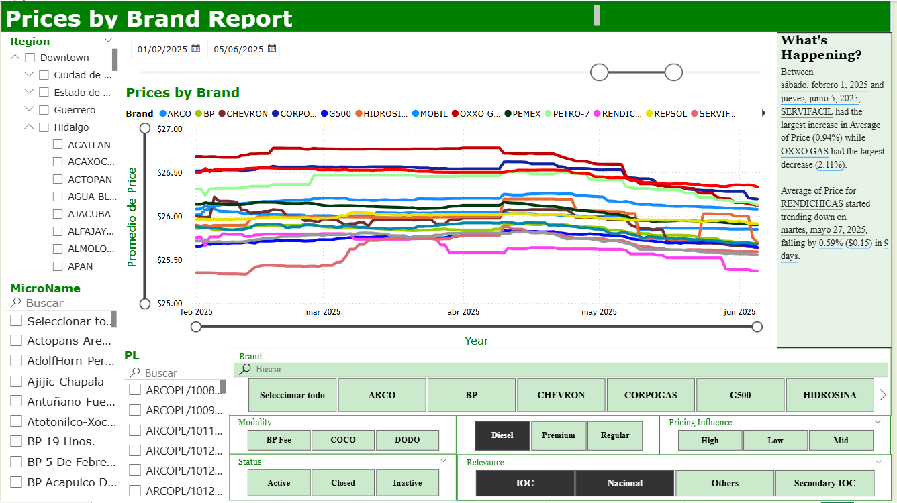

### 📈 Power BI Dashboard – Market Overview (National Position)

Shows monthly cross-section price averages by brand, with dynamic filters by region, market type, modality, and status.

Built in Power BI to support national pricing strategy reviews and market positioning assessments.

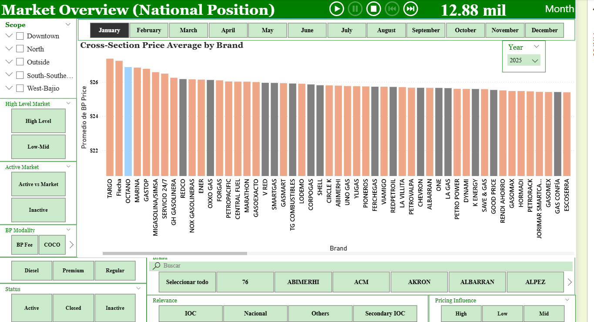

### 🧹 Power BI Dashboard – Prices by Brand (Sites)

Displays individual site price evolution over time. Each line represents a specific site, allowing detailed tracking and outlier detection.

Useful for identifying local pricing issues and evaluating site-level competitiveness.


### 🗺️ Power BI Dashboard – Max & Min Prices by Region

Visualizes the number of stations within specific price ranges across Mexican regions. Helps understand regional price dispersion and extremes.

Supports strategic pricing segmentation by geography.

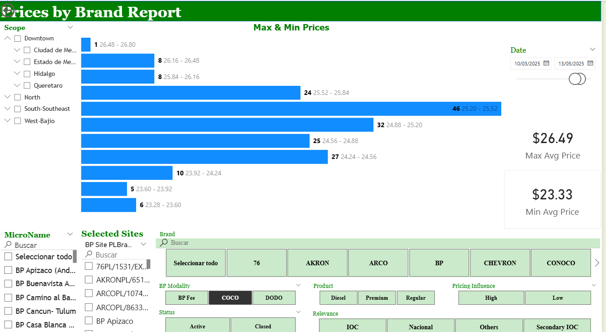

### 📁 Power BI Dashboard – Max & Min Prices Table

Tabular breakdown of station counts by price range on two different dates, including differences and most common price points.

Used for price trend analysis and detecting shifts in market behavior.

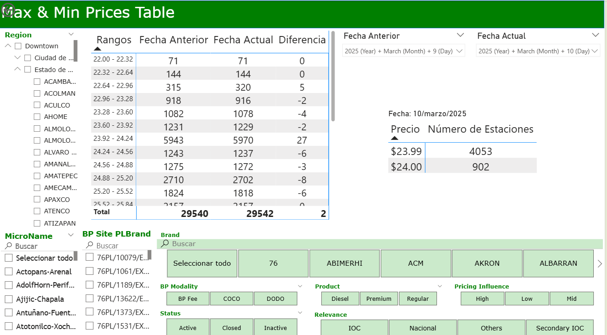

### 📊 Power BI Dashboard – Prices Distribution Table

Shows the number of stations offering each exact price point, alongside a horizontal bar chart for easy visual comparison.

Valuable for understanding price clustering and price point dominance.

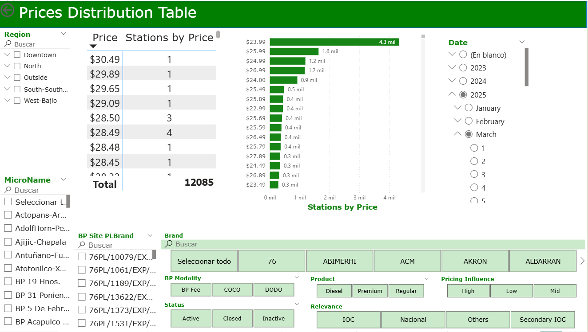

### 💰 Power BI Dashboard – Station Price vs Cost Table

Compares final retail price against estimated costs per station, helping identify margin issues and inefficiencies.

Critical for profitability and pricing optimization.

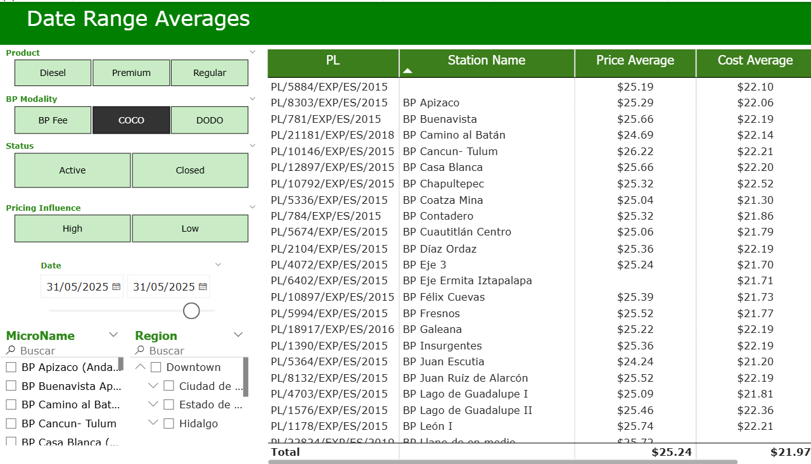

### 🌍 Power BI Dashboard – Station Map Prices

Interactive map showing price levels at each BP station nationwide, filterable by fuel type, modality, and brand relevance.

Designed for geographic pricing strategy and anomaly detection.

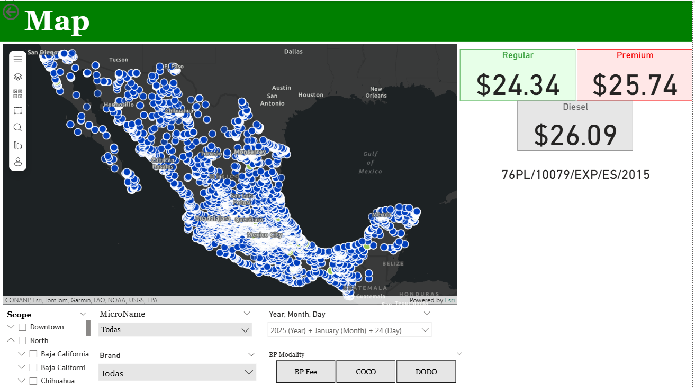

### 📉 Power BI Dashboard – Daily Street Margin (BP)

Displays the daily margin between BP rack (TAR) and final street price for each station. Useful for margin monitoring.

Allows the pricing team to quickly detect margin compression.

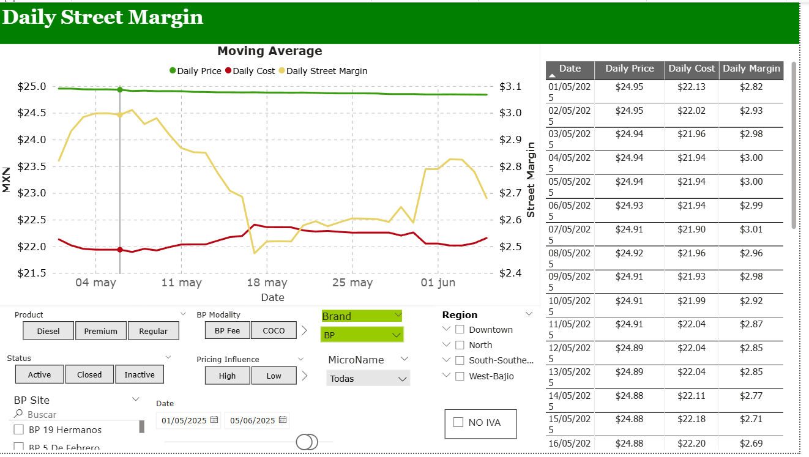

### 📂 Power BI Dashboard – PEMEX Rack Prices

Shows historical PEMEX rack prices for Regular, Premium, and Diesel fuels, enabling historical trend analysis.

Used as a base input for price strategy and cost estimations.

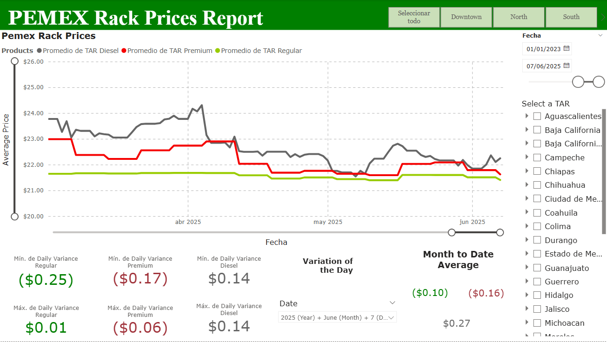

### 📀 Power BI Dashboard – Price Variance Comparison

Compares the variance in pricing across selected sites versus BP's trend. Includes filters by site, region, and relevance.

Designed to monitor compliance with pricing strategy.

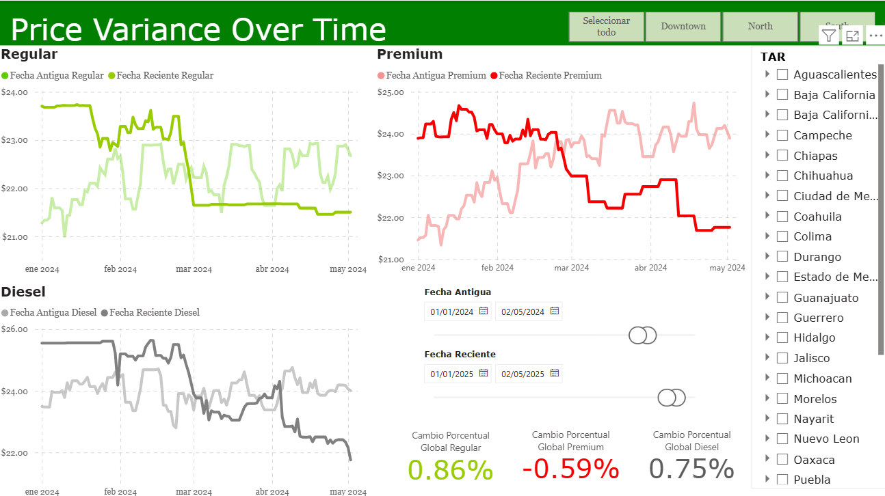

### 🌐 Power BI Dashboard – Benchmark Prices vs Exchange Rate

Displays fuel price benchmarks alongside exchange rate trends, helping correlate international factors with local pricing.

Helps inform strategic decisions in volatile markets.

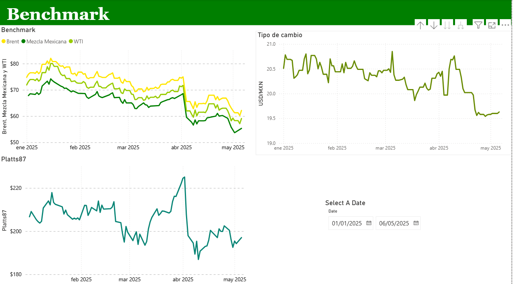

### ⚖️ Power BI Dashboard – Comparative Rack: PEMEX vs Ienova vs Itzoil

Side-by-side comparison of rack prices between three suppliers, allowing better sourcing decisions and negotiation leverage.

Highly useful for procurement and competitor analysis.

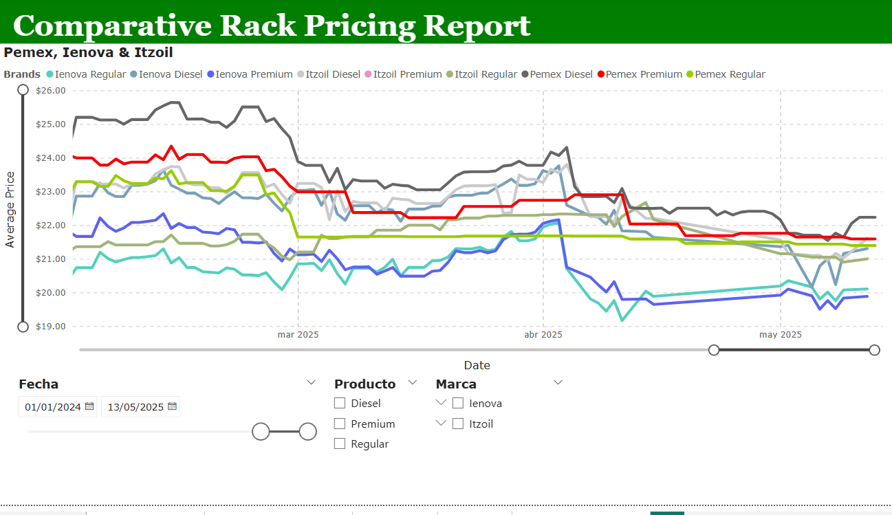
